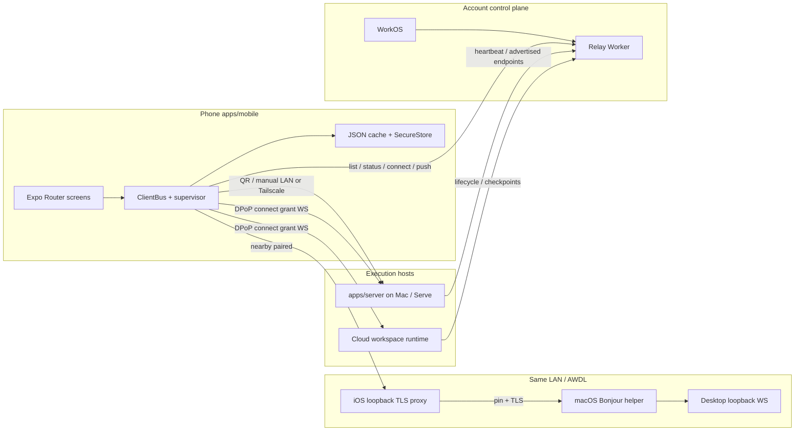
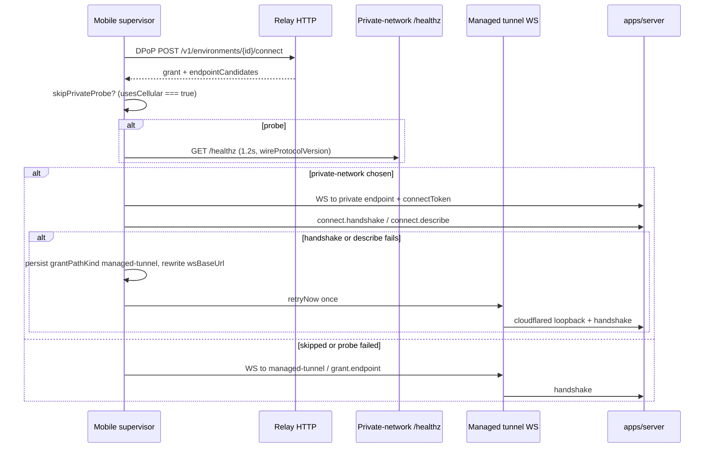
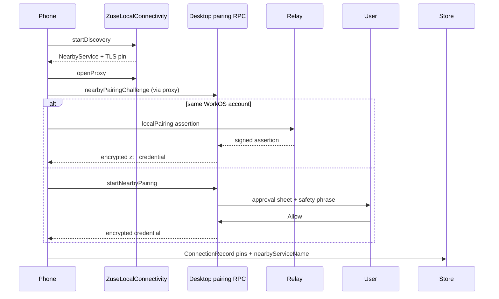

# Zuse Mobile Remote Client — Product and Engineering Plan

| Field | Value |
| --- | --- |
| **Title** | Canonical plan for the mobile remote client |
| **Author** | Engineering (draft) |
| **Date** | 2026-08-26 |
| **Status** | Accepted for implementation |
| **Decisions** | User-resolved Open Questions dated 2026-08-26 |
| **Scope** | Evolve `apps/mobile` (Expo SDK 57 / React Native 0.86) as the remote client for desktop and Serve hosts. No greenfield rewrite. |

---

## Overview

Zuse is a clean, fast, reliable desktop GUI for many AI models and coding agents. The desktop stack (`apps/desktop` + `apps/renderer` + `apps/server`) is the orchestrator host: it owns repositories, provider CLIs, PTYs, Git, and session authority. The phone is a **remote client**. It pairs or signs in, opens one JSON-RPC WebSocket per environment, and supervises chats, permissions, files, review, and terminals. It does not clone repositories or run agents.

That client already exists. `apps/mobile` is a shipping Expo Router app with pairing (QR, nearby Bonjour, manual, WorkOS/DPoP relay), an inbox across computers, live transcripts, composer (attachments, voice, skills, context), approvals, files, Git review, archives, forks, usage, push, and desktop handoff. Product docs at `apps/docs/content/docs/mobile/` describe it as **Zuse for iPhone**. Changelog 0.20.7 records the current feature set.

This document is the canonical product + engineering plan for that app. The default decision is to **keep and evolve `apps/mobile`**. A Flutter, SwiftUI, or Kotlin rewrite is rejected unless a later evidence-backed constraint appears; that case belongs in Alternatives, not in the plan. The remaining work is not scaffolding. It is store-ready reliability, Android parity, off-network path quality, connection lifecycle polish, and a realistic PR sequence on top of the code that already ships.

---

## Background & Motivation

### Why a remote client

Agents run for minutes to hours. The operator is often away from the desk. The phone is the control surface for:

- noticing that a turn needs a permission or an answer;
- steering or interrupting a running session;
- reviewing diffs and files before the next instruction;
- starting a new chat against a project already on the computer;
- handing the same session back to the Mac.

Execution, credentials, and filesystem authority stay on the computer. This is the locked product split in `apps/docs/content/docs/mobile/index.mdx` and `docs/cloud/architecture.md`.

### Current state (high level)

The remote-multiclient initiative (`specs/remote-multiclient/README.md`) is no longer a scaffold. Event-sourced session authority, ClientBus, relay identity, and the Expo app all landed. The first Expo client was read-only (`CHANGELOG.md`, #235). It is now an interactive remote client.

What already works on iPhone:

- Nearby Mac discovery via `_zuse._tcp` Bonjour and a TLS-pinned local loopback proxy (`apps/mobile/modules/local-connectivity`).
- QR pairing and deep-link redemption (`app/connect/scan.tsx`, `app/connect/pair.tsx`, `src/rpc/pairing-client.ts`).
- Manual host:port (`app/connect/manual.tsx`).
- WorkOS PKCE + per-install ES256 DPoP + relay connect grants (`src/auth/`, `src/rpc/relay-client.ts`).
- Shared inbox, new chat, multi-thread sessions, composer, files, review, terminals (iOS native view), archives, usage, push, handoff.

What still hurts:

- Android is a JS-capable sibling, not a product peer. All three Expo modules declare `"platforms": ["apple"]`. There is no `android` key in `app.json` and no `apps/mobile/android/` project. Non-iOS chrome stubs are blocking: `SelectorRow` ignores `options` (new-chat cannot pick machine/project/work mode), `ModelSheet` / `SessionActionsMenu` / `ComposerApprovalMenu` return `null`, `ComposerPlusMenu` jumps to files only.
- Off-network path selection is implemented in `packages/client-runtime/src/endpoint-selection.ts` and tested, but **not wired** into live relay connect. It only applies to grants (`refreshAccountGrant`); QR/manual/nearby-paired records have no tunnel fallback.
- Store distribution is an EAS skeleton (`eas.json`) without TestFlight/Play pipelines, FCM/`google-services.json`, or `expo-updates`. Production omits `EXPO_PUBLIC_ZUSE_RELAY_URL` and PostHog.
- Analytics opt-out is specified in `docs/specs/analytics.md` but exists on **neither** desktop settings nor mobile. `hydrateMobileAnalytics` forces `enabled = true` before `app opened`.
- Direct (paired/manual) Settings rows use `chevron={false}` with no Forget. Hosted rows are tappable but inbox auto-reconnects every online relay environment, so a local delete would come back.

### Pain points for operators

1. First-run is iPhone-shaped. An Android user cannot finish **New chat** (inert selectors) or open session actions (files/review/handoff). Nearby is unavailable and already shows EmptyState + Scan QR; Settings still always offers “Connect to a nearby Mac.”
2. Cellular reach for **account-linked** computers depends on a relay connect grant. LAN-vs-tunnel racing is unused. A **paired-only** phone that leaves Wi-Fi has no tunnel; the supervisor retries a dead LAN address until the user enables hosted access.
3. iOS backgrounding marks the transport offline (`src/store/connection-runtime.ts`). Cached history remains, but push is hosted-account-only. Notification `target` is `zuse://computers?environmentId=…`, a route that no longer exists.
4. There is no complete Forget: paired rows are inert; hosted hide is missing; `removeConnection` does not dispose the supervisor or ClientBus binding.
5. Privacy spec promises **Share usage analytics** on mobile; the toggle is missing, and hydrate captures before any flag is read.

---

## Goals & Non-Goals

### Goals

1. Treat `apps/mobile` as the only mobile remote client and bring it to a store-ready iOS bar, then an Android parity floor.
2. Make first-pair, resume, supervise, approve, review, terminal, reconnect, offline-read, and push-wake journeys complete, including empty and failure states.
3. Keep one connection supervisor and one ClientBus per environment; do not add a second RPC/session stack.
4. Prefer the fastest reachable path (nearby TLS proxy, probed private-network endpoint, then managed tunnel) without changing the wire protocol.
5. Make Android a first-class *compile and degrade* target immediately, then close native gaps in ranked order.
6. Ship TestFlight (iOS) and an internal EAS Android build before Play Store.
7. Align security, redaction, and analytics with existing contracts (`packages/analytics`, `src/lib/redact-diagnostics.ts`, `docs/cloud/security.md`).

### Non-goals

- Running provider CLIs, MCP servers, or agent loops on the phone.
- Replacing desktop or becoming a standalone coding IDE.
- Rewriting in Flutter, SwiftUI, Jetpack Compose, or a second React Native app.
- Duplicating desktop settings density (provider auth, MCP, browser cookies, notch tray, keybindings).
- Implementing ICE / QUIC path-racing from `docs/research/mac-client-connectivity.md` in this phase. That research remains deferred until nearby + tunnel racing is measured.
- Creating or billing cloud workspaces from the phone (checkout, pause, image build). Mobile **discovers and connects**; desktop/web own lifecycle.
- In-app agent browser / visual annotations (`previews` capability is declared; no mobile UI consumes it).
- Editing files as a full CodeMirror workspace. Mobile is preview + review, not an editor host.
- Expo Go as a supported runtime. The dev client is required for local Expo modules and the `react-native-quick-crypto` WebCrypto polyfill (`src/polyfills.ts`). DPoP signing itself uses `@noble/curves` + `expo-crypto`; Expo Go still cannot run the app.

---

## Current-state inventory

### Platform and packaging

| Item | Location | Notes |
| --- | --- | --- |
| Expo SDK | `apps/mobile/package.json` | `expo ~57.0.6`, `react-native 0.86.0`, `expo-router ~57.0.6`, `expo-dev-client` |
| Identity | `apps/mobile/app.json` | name `Zuse`, scheme `zuse`, bundle `com.zuse.sh`, team `HMCST4VV42`, iOS only |
| EAS | `apps/mobile/eas.json` | `development` / `preview` use staging WorkOS + `https://relay-staging.stuff.md`; `production` sets WorkOS client, **no `EXPO_PUBLIC_ZUSE_RELAY_URL`** (falls back via `src/auth/config.ts`) |
| iOS native | `apps/mobile/ios/` | Xcode project `ZuseMobile`, entitlements, `PrivacyInfo.xcprivacy` |
| Android native | — | **Absent.** `package.json` has `"android": "expo run:android"`; no `app.json` android block |
| CI | `.github/workflows/community.yml` | `bun --filter mobile test`, `check-types`, `expo export --platform android` (JS bundle only) |
| Release CI | `.github/workflows/release.yml` | Desktop macOS only; no mobile job |

### Navigation (`apps/mobile/app/`)

Root stack is declared in `app/_layout.tsx`. This **is** the information architecture. Do not add a parallel navigator.

| Route | Role |
| --- | --- |
| `index` | Shared inbox (“Chats”). Search, pin, archive, empty/skeleton, recovery banner, QR + nearby entry points |
| `new-chat` | Machine → project → worktree/branch/PR → provider/model → first prompt |
| `settings` | Form sheet: nearby, manual, remote sign-in, computers, notifications, archives, usage, storage, delete account |
| `archives` | Preview / restore / delete archived chats |
| `usage` | Tokens and provider limits (**uses `connections[0]` only**) |
| `developer-tools` | Owned PTYs + voice capability probe |
| `plan-viewer` | Modal plan document |
| `media-viewer` | Full-screen attachment |
| `connect/nearby` | Bonjour browse + safety phrase + Mac approval |
| `connect/scan` | Camera QR |
| `connect/pair` | Deep-link / legacy `zuse://` pairing URL |
| `connect/manual` | Host, port, optional token |
| `c/[conn]/index` | Per-computer session list |
| `c/[conn]/session/[sessionId]` | Thread: transcript, composer, approvals, questions, plans |
| `c/[conn]/chat/[chatId]/threads` | Form sheet of threads in a chat (not under the session segment) |
| `c/[conn]/session/[sessionId]/files`, `…/file` | Workspace tree + file preview |
| `c/[conn]/session/[sessionId]/review`, `…/resolve-conflict` | Git review + conflict editor |
| `c/[conn]/session/[sessionId]/terminal` | Multi-PTY (iOS native view; Android placeholder) |
| `c/[conn]/session/[sessionId]/tool/[itemId]` | Tool-call detail / patches |
| `smoke` | Dev wire probes |

`CLOUD_AUTH.md` still mentions `app/computers.tsx`. That screen was folded into Settings → Remote access. Update the markdown when touching auth docs; do not resurrect the route.

### Subsystems

**Auth.** `src/auth/workos.ts` — AuthKit PKCE, redirect `zuse://auth`, session in `expo-secure-store` key `zuse.mobile.workos.session.v1`. `src/auth/dpop.ts` — per-install P-256 key (`zuse.mobile.dpop.private.v1` / `public.v1`), ES256 DPoP proofs. Signing uses `@noble/curves` plus `expo-crypto` randomness; `polyfills.ts` still installs `react-native-quick-crypto` for WebCrypto/`randomUUID`. Expo Go cannot run this.

**Relay HTTP.** `src/rpc/relay-client.ts` implements `packages/contracts/src/relay.ts` paths: list environments (WorkOS bearer), DPoP token (single-flight; refresh when fewer than **30 seconds** remain of a **30-minute** access token — `accessTokenTtlMs` in `infra/relay/src/config.ts`), status, connect (optional `localPairing` assertion), device register, account delete. Relay is control plane only; chat bytes never go through Worker Postgres. Mobile does **not** mint WorkspaceGateway client tickets and does **not** call `cloud.transcript.get` (that RPC is desktop `apps/server/src/machine/handlers.ts` → renderer).

**Pairing HTTP.** `src/rpc/pairing-client.ts` POSTs `/pair` with `{ code, deviceId, deviceLabel }`, expects `zt_` bearer. Codes expire (410 / `expired_code`). Nearby pairing is a different handshake: X25519 device key (`src/lib/pairing-device-key.ts`), safety phrase (`src/lib/nearby-pairing.ts`), Mac `pairing.resolveNearbyRequest`.

**Connection runtime.** `src/rpc/connection.ts` composes `createConnectionSupervisor` from `@zuse/client-runtime/supervisor` with `makeRpcClientSession` over `MemoizeRpcs`. Open timeout is **25 seconds** for managed-tunnel cold start. Today `maxAutomaticAttempts` is unset → infinite 1s–16s backoff for every source. PR 2 sets `maxAutomaticAttempts: 3` for paired/manual only. AppState background → `setConnectionOnline(false)`; foreground retries ClientBus (`src/store/connection-runtime.ts`). Nearby path changes bump `routeGeneration` and call `applyConnectionOptions` (`src/store/local-connectivity-runtime.ts`). That nearby republish path is the implemented LAN reconnect design; it does not give paired-only devices a tunnel (J15).

**Inbox loading.** `hydrateSessionsOnce` already applies `readSessionsSnapshot` **before** the network call, then sets `loadingByConnection[key] = true`. Home still skeletons because `app/index.tsx` treats `loadingByConnection` and `environmentsLoading` as blocking even when `bundlesByConnectionAtom` already has cached rows.

**ClientBus.** `src/store/mobile-client-bus.ts` is the mobile `EnvironmentRuntime` edge: one bus, session-timeline and terminal resource drivers, durable command outbox (`MobileCommandOutbox` persisted under `zuse-cache/client-command-outbox.json`), 200 ms timeline checkpoints. Session mutations go through `dispatchMobileSessionCommandResult` with stable `CommandId`s.

**Offline cache.** `src/offline/cache.ts` is **JSON files in `expo-file-system` document directory**, not SQLite. Snapshots: sessions list, per-session timeline projection + cursor, editable offline drafts (`src/store/outbox.ts`), ClientBus outbox. `docs/cloud/realtime-and-storage.md` documents a “Mobile SQLite adapter”; that adapter is **not implemented**. Corrupt JSON is deleted (`CacheCorrupt`).

**Media cache.** `src/lib/media-cache.ts` — 100 MiB / 7 day LRU in cache dir `zuse-protected-media-v1`.

**Push.** `src/notifications/push.ts` + `infra/relay/src/push.ts`. Expo push tokens registered at `RelayPaths.devices` after WorkOS sign-in. Relay sends approval/question/completed/error/running. Notification `data.target` is a deep link. **Requires hosted account.** Paired-only LAN has no push channel.

**Analytics / crash.** `src/lib/analytics.ts` — PostHog RN, catalog from `@zuse/analytics`, no session replay, no autocapture, `before_send` drops unknown events. `hydrateMobileAnalytics` currently sets `enabled = true` then emits `app opened`. Desktop renderer settings have **no** “Share usage analytics” string (`AnalyticsServiceLive` hardcodes `enabled: true`). `src/lib/crash-reporting.ts` writes last crash to document dir. Diagnostics redact secret-shaped keys (`src/lib/redact-diagnostics.ts`). Nearby pairing still `console.info("[zuse:nearby] …")` without that redaction pass.

**Native modules** (`apps/mobile/modules/`):

| Module | Platforms | Job |
| --- | --- | --- |
| `local-connectivity` | apple | Bonjour browse, NW path monitor, TLS-pinning loopback proxy, trust-record proofs |
| `mobile-platform` | apple | Quick Look, `beginBackgroundTask` (voice), save to Photos |
| `mobile-terminal` | apple view + android JS stub | iOS `TerminalView` native manager; Android placeholder “Interactive terminals are currently available on iPhone.” |

`requireOptionalNativeModule` means JS does not crash when a module is missing; nearby simply reports unavailable.

### Desktop / server counterparts

- Settings → Devices: `apps/renderer/src/components/settings/devices-pane.tsx` — local access toggle, Tailscale share, hosted relay, QR / pairing link (`connect-link-card.tsx`), connected-device revoke (`pairing.listTokens` / `pairing.revokeToken`).
- Nearby approval sheet: `apps/renderer/src/components/nearby-pairing-approval.tsx`.
- Pairing RPCs: `packages/contracts/src/pairing.ts`.
- Capability bits: `packages/contracts/src/connect.ts` `CapabilityFeature` (`mobile-terminal-v1`, `attachment-read-v1`, `voice-account-transcription-v1`, `git-remote-actions-v1`, `desktop-handoff-v1`, …). Mobile gates UI with `connectionSupports` (`src/lib/connection-records.ts`).
- Handoff: `host.openSession` from `src/rpc/actions.ts` `openSessionOnHost`.
- Serve: `zuse serve` prints pairing URLs (`CHANGELOG` 0.20.7). Same WS protocol.

### Tests already in tree

`apps/mobile/test/unit/` covers pairing URL parse, nearby approval, DPoP/relay clients (including single-flight), connection failures, endpoint selection, outbox, ClientBus, media cache policy, transcript scroll, composer submit gate, redaction, push registration, UI contracts (theme, form sheet, iOS menus). `test/integration/rpc/ws-protocol.test.ts` exists. Native Swift tests live only under `modules/mobile-terminal/ios/Tests/`. There is **no Detox/Maestro suite** and **no device CI**.

---

## Gap analysis

Ranked by user-visible severity × blast radius. P0 blocks a stated journey or a store submission. P1 is a reliability or parity hole. P2 is polish.

### P0 — product-complete remote client

| Gap | Evidence | Impact |
| --- | --- | --- |
| Live **relay** connect ignores private-network vs tunnel racing | `chooseGrantEndpoint` is unit-tested only; `prepareOptions` and `connectToEnvironment` write `grant.endpoint` raw. QR/manual/nearby records never enter this path | Extra tunnel latency on Wi-Fi for hosted computers; no off-LAN path for paired-only |
| Incomplete Forget | Direct Settings rows `chevron={false}`; hosted rows tappable; inbox auto-connects every online relay env; `removeConnection` does not `disposeConnection` or unbind ClientBus | Reset app is the only way to drop a paired Mac; hosted “forget” would be undone |
| Analytics opt-out missing; hydrate always enables | Spec vs `app/settings.tsx`; `hydrateMobileAnalytics` sets `enabled = true` then `app opened`. Desktop has no matching toggle either | Store / privacy contract; first-capture before opt-out |
| Android JS chrome blocks J8/J10/J14 | `selector-row.tsx` ignores `options`; `model-sheet.tsx` / `session-actions-menu.tsx` / `composer-approval-menu.tsx` return `null`; plus menu files-only | New chat, files, review, model change, handoff unreachable on Android |
| Android has no native project, FCM, or `app.json` android block | Inventory; no `google-services.json` | Cannot `expo run:android` repeatably; Expo push on Android will not deliver |
| EAS production omits relay URL and PostHog | `eas.json` production vs `src/auth/config.ts` `__DEV__` fallback | Staging/prod mix-up (`CHANGELOG` 0.20.4 class of bug) |
| No TestFlight/Play pipeline | `release.yml` desktop-only; `submit.production` `{}`; notification deep link hits deleted `/computers` | Cannot distribute; push taps do nothing useful |

### P1 — reliability, off-network, Android floor

| Gap | Evidence | Impact |
| --- | --- | --- |
| JSON file cache vs documented SQLite adapter | `offline/cache.ts` vs `docs/cloud/realtime-and-storage.md` | Large transcripts, atomicity. **PR 14 this year** (after TestFlight + Android floor) |
| No mobile R2 checkpoint catch-up | Desktop uses `cloud.transcript.get`; mobile has no caller. Opening a cloud WS can wake compute | Paused cloud history on phone is JSON-cache-only until live attach |
| Push is hosted-only; target URL stale | `shouldRegisterPushToken` (WorkOS required — locked); relay `zuse://computers?environmentId=` | Paired-only stay without push; hosted taps hit a deleted route (PR 2 maps it) |
| Usage screen is first-connection only | `app/usage.tsx` `connections[0]` | Multi-computer operators see the wrong machine |
| Inbox skeletons over cached bundles | `loadingByConnection` set **after** snapshot apply; `environmentsLoading` blocks whole inbox | Cached paired chats hidden while relay list loads |
| Protocol mismatch has no user copy | ClientBus can surface `update-required`; `connection-error-message.ts` does not map it | Operator sees a raw error string |
| `CLOUD_AUTH.md` stale (`computers.tsx`, “same Wi-Fi today”) | File vs current Settings + tunnel grants | Onboarding confusion |
| No Maestro/Detox or device CI | community.yml unit + Android JS export only | Pairing/composer regressions land in TestFlight |

### P2 — polish / later

| Gap | Notes |
| --- | --- |
| ICE / regional relays | Research doc explicitly deferred |
| Cloud create/pause/checkout on phone | Desktop/web own this |
| Agent browser / preview ports | Capability `previews` unused |
| File editing | Preview-only is correct for v1 of this plan |
| OTA (`expo-updates`) | Not in package.json |
| Screenshot / recents redaction of source | No `FLAG_SECURE` / iOS screen-capture hook |
| `usage` / archives empty-state illustrations | Functional empty states exist; visual polish later |
| Notification copy still says “iPhone Settings” on Android | `app/settings.tsx` |
| Play Data safety form | PR 19 | Human Console answers at Play submit |
| Nearby Settings row on Android | Screen already EmptyState + Scan QR; Settings still always offers nearby |

### Desktop capability delta (intentional vs missing)

Mobile **should not** grow these: provider CLI login, MCP server config, browser-cookie import, notch tray, keybindings, CodeMirror editing, cloud billing/checkout, Linear project admin.

Mobile **should** keep feature-parity for operator loops that already have RPC: chats, permissions, questions, plans, files, diffs, git remote actions (gated), terminals (gated), voice (gated), handoff (gated), archives, forks, attachments.

---

## Target journeys

Story-first. Each journey lists happy path, empty, and failure. Screens already exist unless marked **gap**.

### J1 — First-time pair: nearby (iPhone)

1. Mac: Settings → Devices → enable local access (restart). Desktop: `devices-pane.tsx`.
2. Phone: Settings → Connect to a nearby Mac (`app/connect/nearby.tsx`).
3. Native module browses `_zuse._tcp`. One Mac → auto-start; many → list.
4. Phone shows safety phrase; Mac sheet **Is this you trying to connect?**
5. Allow → encrypted `zt_` credential stored in SecureStore connection record (pins, not IP).
6. Inbox opens; `watchConnection` + `hydrateSessions`.

Empty: discovery `waiting` → “Scan QR instead” after 8s (`showQrFallback`).  
Failure: phrase mismatch → do not approve (human). TLS pin fail → `verifyPinnedLocalServer` rejects. Mac deny/block → error + QR fallback.

**Android:** `localConnectivityAvailable === false` already renders EmptyState + **Scan QR** (`app/connect/nearby.tsx`). Remaining gap is Settings still offering “Connect to a nearby Mac” and the empty state omitting hosted/manual links. Do not treat nearby-unavailable as unshipped.

### J2 — First-time pair: QR

Inbox or Settings → Scan (`app/connect/scan.tsx`). Camera permission empty state already exists. QR is a one-time secret + identity (`docs/research/mac-client-connectivity.md`), 5 minute expiry. Deep links hit `app/connect/pair.tsx`; legacy `zuse://…pairingUrl=` rewritten in `_layout.tsx`.

Failure: expired/used code (`pairing-client.ts` 410/401), camera denied, LAN unreachable.

**Off-network:** QR pairing stores a LAN (or Tailscale Serve) endpoint, not a relay grant. Leaving the house is **J15**, not a QR retry.

### J3 — First-time pair: manual

Settings → Add manually. Host/port/token. `addConnection` redeems `zp_` codes then `connect.describe`. Failure if describe fails for paired/manual. Same LAN/Tailscale limit as J2.

### J4 — Account computers (hosted / cloud / Serve)

Settings → Sign in for remote access (WorkOS). `refreshEnvironments` lists relay catalog; presence fan-out via `getEnvironmentStatus`. Home auto-connects online environments not already in `connectionsAtom` (`app/index.tsx`). Tap uses `connectToEnvironment` → DPoP grant → WS.

Empty: signed in, zero environments → copy pointing at desktop **Set up remote access**.  
Failure: `invalid_dpop_proof` / expired WorkOS (`connection-error-message.ts`), computer offline. **Gap:** `update-required` / `WireProtocolMismatchError` is not mapped in `connection-error-message.ts` — add “This computer needs a Zuse update” (or the inverse) instead of the raw string.

### J5 — Resume last computer

Today: all saved reachable connections reconnect at inbox mount; online account environments auto-add. There is no explicit “last computer” preference. **Keep this.** Multi-computer inbox is the product.

**Gap is the loading predicate, not missing snapshots.** `hydrateSessionsOnce` already writes cached bundles before the network call. Home still skeletons when `loadingByConnection[key] === true` or when `account !== null && environmentsLoading`, even if paired chats are already in memory. Target: skeleton only when there is no snapshot **and** no in-memory bundles; keep `ConnectionRecoveryBanner` for socket state; never let `environmentsLoading` hide cached paired chats.

### J6 — Supervise a running agent

Open chat → `c/[conn]/session/[sessionId]`. LegendList + `TranscriptScrollCoordinator`. Live events via ClientBus timeline resource. Inbox row shows running. Interrupt via composer stop.

Failure: reconnect banner (`ConnectionRecoveryBanner`) with Retry; cached turns stay. Do not blank the transcript (realtime-runtime rule).

### J7 — Approve permissions / answer / plan

`PendingApprovalCard`, `PendingUserInputCard`, `PlanReviewCard`. `permission.decide` is not blindly outboxed as a replay of terminal input; it is a session command. `forcePrompt` hides “Allow session” for sensitive paths (mirrors renderer).

Empty: no pending card.  
Failure: decide while offline → error, card remains. Push (if hosted) deep-links `data.target`.

### J8 — Inspect files / diff

Session ⋯ → Files / Review changes. Tree from `fs.listPaths`; preview `fs.readFile`; review `git.reviewSummary` + `git.reviewPatches`. Conflict: `resolve-conflict`. Scope workspace vs last-turn.

Empty: no changes pill. Unsupported/binary called out.  
Failure: oversized preview unavailable (docs). **Android: J8 is blocked on PR 7** (`SessionActionsMenu` returns `null`).

### J9 — Terminal

Session ⋯ → Terminal if `mobile-terminal-v1`. `pty.list` / `pty.open` with `mobileOwnership`. iOS native view; input pump from `@zuse/client-runtime/terminal-input-pump`. Landscape unlocked only on this route (`_layout.tsx`).

Android: keep the route and the existing placeholder until the **parity** terminal PR (not the Android floor). Floor still needs session ⋯ so the user can open the route and read the placeholder.

### J10 — New chat

`new-chat.tsx`: machine, project, work mode (checkout/worktree/branch/PR), provider/model from `provider.availability` (null → static catalog). Attachments upload before send.

Failure: upload error stays in composer (`composer-attachments.ts`). Offline: outbox draft.

**Android: J10 is blocked on PR 7.** `SelectorRow` renders the label only and ignores `options`. `ModelSheet` is null. Plus menu cannot pick camera/images/goal/plan.

### J11 — Reconnect after backgrounding (already implemented)

Background → supervisor `setConnectionOnline(false)`. Foreground → `retryMobileClientBusConnections`. Nearby: path monitor + Bonjour republish + `routeGeneration` / `applyConnectionOptions` (`local-connectivity-runtime.ts`). Brief Connecting is expected (`offline-notifications.mdx`). `maxAutomaticAttempts` is unset (infinite 1s–16s backoff) until a new route arrives.

This journey is **not** the place for a new background-task wrap around every command. Nearby republish is the LAN reconnect design. Paired-only off-LAN is J15 (`maxAutomaticAttempts: 3` / `usesCellular`, not infinite reconnect).

### J12 — Offline read + queued send

Cached sessions/messages remain. Composer enqueue → `src/store/outbox.ts` drafts → on connect `submitOutboxDrafts` transfers into ClientBus outbox with stable client IDs. ClientBus is sole retry owner after transfer.

Reset app **drops outbox** (documented warning). Clear downloaded data does not.

### J13 — Push wake-up

Hosted: enable notifications in Settings. Relay Expo push (`infra/relay/src/push.ts`). Tap → `Linking.openURL(data.target)`.

**Today’s target is broken:** `zuse://computers?environmentId=…` (`infra/relay/src/handler.ts`). There is no `/computers` route. Required: map that URL in `_layout.tsx` to inbox + `connectToEnvironment` (and skip if hidden). If the connection is not yet hydrated, wait for `connectionsHydrated` then connect; on failure show the recovery banner, do not hang on a missing screen.

Gap: paired-only has no push; lock-screen preview policy is OS-level. Android copy still says “iPhone Settings.”

### J14 — Desktop handoff

⋯ → Open on desktop if `desktop-handoff-v1` → `host.openSession`. Failure: alert. **Android blocked on PR 7.**

### J15 — Paired-only, then left the house (new)

Happy path does **not** exist today. QR/manual/nearby records have `refreshAccountGrant !== true`, so `prepareOptions` never mints a relay grant.

**Stop condition (locked, PR 2):** for `source` `paired` | `manual` only, pass `maxAutomaticAttempts: 3` into `createConnectionSupervisor` (relay records keep the default, infinite). After 3 consecutive failures the supervisor emits `status: "error"` (`packages/client-runtime/src/supervisor.ts` already does this). Also exhaust immediately when `usesCellular === true` (same `onLocalPathChanged` flag as PR 1; unknown ⇒ count only, never NetInfo): call `exhaustConnection(options, message)` on the supervisor entry (add `exhaust(message)` to `ConnectionSupervisorEntry` in `packages/client-runtime/src/supervisor.ts` — `clearRetry`, `invalidateClient`, `emit({ status: "error", error })`). Nearby republish (`routeGeneration`) still calls `retryNow` and resets the counter when a LAN/AWDL route actually returns.

`ConnectionRecoveryBanner` today hides the secondary action while `recovering`. The stop condition must leave `error` (not `reconnecting`) so actions are visible:

- Message: **“This phone can only reach this Mac on the same network.”**
- **Enable remote access** → Settings sign-in (J4). If the Mac is already account-linked, auto-connect adds a relay record and racing applies.
- **Retry** → `retryNow()` (attempt counter back to 0).
- **Forget** → paired Forget (PR 2).
- Do not imply a tunnel will appear from a QR pair.

Until the user also signs in, QR/manual remain LAN or Tailscale.

---

## Proposed design

### Architecture — connection graph



Cloud workspaces use the **same** mobile path as hosted Macs: DPoP `POST /v1/environments/{id}/connect` → `RelayConnectGrant` → supervisor WebSocket. The grant’s `endpoint.wsBaseUrl` may be a WorkspaceGateway URL; the phone does not mint client tickets and does not speak `cloud.transcript.*`. Opening that socket can wake compute — that is current behavior, not R2 catch-up.

Rules (already in `docs/architecture/realtime-runtime.md`):

- One supervisor per environment. Screens do not open sockets.
- WebSocket is disposable. SQLite on the host is transcript authority.
- Relay never carries chat events.
- Discovery is not authorization (nearby research doc).
- `/healthz` is unauthenticated; **handshake + `connect.describe` is the bind**, not the probe.

### Path selection (this phase)



**Scope:** relay grants only (`refreshAccountGrant === true`). QR/manual/nearby never call this helper.

**Change:** one shared helper (used by both `connectToEnvironment` and `prepareOptions`) that:

1. `connectEnvironment(environmentId)` once.
2. Decides whether to probe (single rule below).
3. Returns `{ endpoint, grantPathKind, connectToken, probeMs }`.
4. Persists `wsBaseUrl`, host, port, `grantPathKind` on the connection record **before** first `getClient`.

`choosePreferredEndpoint` still returns only `EnvironmentEndpoint`. Mobile’s `chooseAndDescribeGrant` wrapper is the only place that returns `kind`. `/healthz` is unauthenticated — the wrapper **ignores** `connectToken`.

**Probe policy (one locked rule):**

```
cellular = last onLocalPathChanged.usesCellular   // boolean | unknown
skipPrivateProbe =
  (cellular === true)                             // commute: do not wait 1.2s on a dead LAN
  || no private-network candidate
probe = !skipPrivateProbe && private-network candidate exists
```

- `cellular === unknown` (no `local-connectivity` module, typical Android floor): **probe**. Do not add NetInfo.
- Last `grantPathKind` is **not** part of the skip predicate. Persist it for logs and for handshake-fail fallback only.
- Probe success: `status === "ok"` and exact `WIRE_PROTOCOL_VERSION` within 1.2s. Else use `managed-tunnel` candidate or `grant.endpoint`.

Not Happy Eyeballs. Not ICE.

After racing is instrumented (`path_kind`, `endpoint_probe_ms`), revisit `docs/research/mac-client-connectivity.md`.

### Nearby pairing (unchanged protocol)



Android nearby is a later native module (NSD + TLS pin). Until then, Android uses QR/manual/hosted.

### Auth stack

| Secret | Storage | Lifetime |
| --- | --- | --- |
| WorkOS access + refresh | SecureStore `zuse.mobile.workos.session.v1` | Access skewed 60s; refresh rotates |
| DPoP P-256 | SecureStore `zuse.mobile.dpop.*` | Install lifetime; cleared on reset |
| Nearby X25519 | SecureStore `zuse.nearby.x25519.private.v1` | Install lifetime |
| Connection records (incl. `zt_` token) | SecureStore `zuse.mobile.connections.v1` | Until forget / revoke / reset |
| Relay DPoP access | In-memory | 30 min TTL; refresh when <30s remain |
| Connect grant | Connection record + supervisor options | Short-lived; `refreshAccountGrant` re-mints |
| Hidden hosted ids | SecureStore `zuse.mobile.hidden-environments.v1` | Until unhide / reset |

Mac `pairing.revokeToken` remains desktop-only. Phone Forget/Hide never invalidates `zt_` on the host — Settings copy must say so.

### Client data path

```text
UI action
  -> stable CommandId
  -> ClientBus outbox (retry: safe | never)
  -> supervisor.getClient()
  -> MemoizeRpcs over WS
  -> SessionDomain on host
  -> ordered projection
  -> ClientBus reducer (generation + cursor fence)
  -> JSON checkpoint (200 ms)
  -> atoms -> screen
```

Offline drafts stay in `queuedBySessionAtom` until transfer. Terminal bytes never enter canonical atoms (terminal sink); do not persist PTY bytes in the JSON cache.

### Native module policy

- Keep `requireOptionalNativeModule`.
- Every module gets an Android implementation **or** an explicit JS unavailable adapter that surfaces a product sentence (already the pattern for terminal).
- Do not compile iOS Network.framework code into Android. Copy the **pattern** from desktop `docs/architecture/host-platform.md` (capability flags, explicit unavailable adapters). Mobile has no `HostDescriptor`; today it branches on `Platform.OS` in theme/menus. New work should prefer `localConnectivityAvailable` / `mobileTerminalAvailable` (the first already exists) rather than citing HostDescriptor as if it shipped on the phone.

---

## Information architecture / navigation

Keep the current Expo Router tree. Evolve in place.

### Proposed adjustments (small)

1. **Settings connection rows** are three distinct operations (see API). Do not add `/computers`.
2. **Usage** takes `?conn=` or a picker (P1, not a TestFlight gate).
3. **Android JS chrome** (floor, not polish): ActionSheet/list fallbacks for session actions, selector rows, model sheet, plus menu, approval menu. Same route targets as iOS.
4. **Nearby Settings copy:** hide or retarget “Connect to a nearby Mac” when `localConnectivityAvailable === false`; empty state already has Scan QR — add hosted + manual links only.
5. **No tab bar.** Inbox is home. Settings is a form sheet. Session is a stack.

### Deep links

`_layout.tsx` today only special-cases legacy pairing URLs. Required map:

| URL | Handler | Required state | Failure |
| --- | --- | --- | --- |
| `zuse://auth` | WorkOS PKCE (`src/auth/workos.ts`) | none | `workos_sign_in_cancelled` |
| `zuse:///connect/pair?pairingUrl=` / `zuse://connect/pair` | `app/connect/pair.tsx` | LAN/Tailscale reachability | pairing empty state |
| `zuse://computers?environmentId=` | **Add** in `_layout.tsx`: hydrate connections, skip if hidden, `connectToEnvironment`, `returnToInbox` | WorkOS session | recovery banner; never a missing screen |
| `zuse://c/{conn}/session/{sessionId}` | existing stack if we start emitting it | connection record | else inbox |

Relay must keep emitting `zuse://computers?…` until a coordinated change; the phone adapts first.

---

## Platform decision: keep React Native + Expo

### Rationale

- The app is not a prototype. It shares `@zuse/contracts`, `@zuse/client-runtime`, `@zuse/analytics`, `@zuse/icons` with desktop. A native rewrite duplicates the RPC/session/outbox stack.
- Expo Router, EAS, SecureStore, Camera, Notifications, AuthSession, and local Expo modules are already the integration surface.
- iOS polish uses `@expo/ui` SwiftUI menus and glass; that is compatible with keeping RN and degrading Android menus.
- Community CI already typechecks and exports the Android JS bundle.

### Expo Go

Unsupported. Local Expo modules and the WebCrypto polyfill (`react-native-quick-crypto` in `src/polyfills.ts`) require a **dev client**. DPoP JWS signing is `@noble/curves` + `expo-crypto`; Go still lacks the modules. Document this in `CLOUD_AUTH.md`; do not spend time making Go work.

### Why not Flutter / Swift / Kotlin

| Option | Cost | Loss |
| --- | --- | --- |
| Flutter rewrite | Full UI + FFI for WS/RPC/Effect | Two-year feature delta; no shared TS contracts without a new FFI layer |
| SwiftUI iOS + Compose Android | Two UI toolkits | Duplicates ClientBus, pairing, DPoP, outbox; contradicts “one behavior, one source of truth” (`Agents.md`) |
| New RN app | Empty `apps/mobile2` | Throws away pairing, review, composer, tests |

None of these are justified by current gaps. The gaps are Android native modules, distribution, and a few wiring bugs.

---

## Android plan

Honest assessment: **JS runs; product journeys J8/J10/J14 do not.** Community CI `expo export --platform android` only proves Metro. There is no Gradle project, no FCM, no `google-services.json`.

Application id is locked: **`com.zuse.sh`** on Android as on iOS.

### Floor (must ship before calling Android supported)

This floor is PRs **6 then 7**. Native terminal is **parity**, not floor.

1. **Prebuild (PR 6).** `app.json` `android.package = "com.zuse.sh"`, `googleServicesFile` pointing at an EAS secret `google-services.json` (not a dummy empty file). Permissions: `INTERNET`, `CAMERA`, `RECORD_AUDIO`, `POST_NOTIFICATIONS`, photo/media as required by Expo image picker. Adaptive icon assets. `targetSdk` current Play default; 16 KB page-size compatibility via Expo 57 / NDK settings EAS already documents. Commit `apps/mobile/android/` like `ios/`. Gitignore `local.properties`, `*.keystore`, `android/.gradle/`. First PR is noisy; keep it prebuild-only (no chrome). Cache `~/.gradle` in CI once the tree exists.
2. **JS chrome that unblocks J8/J10/J14 (PR 7).** Merge without waiting for a device: `SelectorRow` must present `options`; `SessionActionsMenu`, `ModelSheet`, `ComposerApprovalMenu`, `ComposerPlusMenu`, `ModelModePill` must call the same handlers as their `.ios.tsx` twins via React Native `ActionSheetIOS`-equivalent (`ActionSheet` / `Alert` buttons). New-chat selectors are **blocking**, not polish.
3. **FCM.** Expo push on Android does not deliver without `google-services.json`. Include it in the floor so notifications are not a later surprise.
4. **Nearby copy.** Screen already handles unavailable. Settings: do not advertise nearby when `localConnectivityAvailable === false`; QR + hosted + manual remain.
5. **Terminal route.** Keep the existing Android placeholder. Do not hide the route. Do not require a native PTY view for “Android supported.”
6. Push JS already sends `platform: "android"`. Runtime `POST_NOTIFICATIONS` prompt on 13+.
7. Dynamic color already has Android Material mappings in `src/theme.ts`.
8. Notification strings: “Allow notifications in system Settings,” not “iPhone Settings.”

### Parity (after TestFlight is boring)

1. Native/RN PTY view (PR 12+). Reuse `pty.*` and `terminal-input-pump`.
2. NSD + TLS-pinning (PR 17) only if QR/hosted pain is real. Unpinned mDNS is rejected.
3. `Intent.ACTION_VIEW` document preview vs Quick Look.
4. Voice foreground service.

### Testing

- Unit tests already run on Node. PR 7 extends `native-menu-compat.test.ts` so Android fallbacks export the same action ids and **invoke** `onSelect`.
- Device smoke: one EAS preview APK after PR 6.

---

## API / interface changes

No new **host** RPC is required for P0. Host already speaks `MemoizeRpcs`. Cloud R2 catch-up, if ever, is a new Relay HTTP contract (PR 13 spike) — not “existing client tickets.”

### Shared grant chooser (PR 1)

```ts
// apps/mobile/src/rpc/endpoint-selection.ts
export type ChosenGrant = {
  readonly endpoint: EnvironmentEndpoint;
  readonly grantPathKind: "private-network" | "managed-tunnel";
  readonly connectToken: string;
  readonly probeMs: number | null; // null when probe skipped
};

export const chooseAndDescribeGrant = async (
  grant: RelayConnectGrant,
  opts: { readonly skipPrivateProbe: boolean },
): Promise<ChosenGrant> => { /* skipPrivateProbe = usesCellular === true */ };
```

Call sites (both, one helper, **one** `connectEnvironment` per generation):

- `connectToEnvironment` → persist `wsBaseUrl`, host, port, `grantPathKind` via `addRelayConnection` **before** `watchConnection`.
- `prepareOptions` (relay branch only) → same helper; write the same fields back with `updateDiscoveredConnectionRoute`-style persist so the record cannot disagree with the supervisor.

Assert in tests: (1) `/healthz` mismatch falls back to `grant.endpoint` without opening the private WS; (2) green `/healthz` then handshake/`connect.describe` failure persists `grantPathKind: "managed-tunnel"`, rewrites `wsBaseUrl` to the tunnel candidate, and `retryNow` **once** (supervisor reconnects because `shouldReconnectOnOptionsChange` watches `wsBaseUrl`); (3) supervisor does not open twice on the first chosen URL — persist **before** first `getClient`. Keep 25s WS timeout. There is no `connection-*.ts` test file today besides `connection-failures.test.ts`; add one with mocked `connectEnvironment`.

### Connection teardown (PR 2)

Three operations. `pairing.revokeToken` stays desktop-only.

Settings is a form sheet over the inbox, so `watchConnection` stays mounted until `connectionsAtom` changes. `ClientBus.forget` returns `false` while `activations.size > 0` (`packages/client-runtime/src/client-bus.ts`). Order is therefore **atom first, then leases, then dispose**.

**Forget paired/manual** (`source` is `paired` | `manual`):

1. If any `c/[conn]/…` route for that key is mounted, `returnToInbox` first (drops session/terminal retains).
2. `removeConnection(key)` — updates `connectionsAtom` + SecureStore. Home’s `reachableConnections` effect then unsubscribes `watchConnection` / stops hydrate.
3. `releaseMobileEnvironment(connKey)` — **new**: release every ClientBus lease for that `environmentId` (timeline + terminals), then `forget` remaining keys (must see `activations.size === 0`), then `bindings.delete`.
4. `disposeConnection(options)`.
5. Delete persistence for that key (sessions, messages, drafts, outbox rows — JSON today, SQLite after PR 14) and `clearMediaCache(key)`.
6. Copy: “This phone will forget the Mac. The Mac still trusts this device until you revoke it in Settings → Devices.”

**Hide hosted** (`source === "relay"`):

1. Persist `environmentId` in `zuse.mobile.hidden-environments.v1`.
2. Same steps 1–5 as Forget (including `removeConnection` so the live inbox drops the record). Inbox auto-connect **must** skip hidden ids. Test: hide a relay environment; remount home; it is not re-added while online.
3. Settings row remains under Remote access with **Show on this phone**. Unhide removes the id and allows auto-connect again.
4. Copy: hiding does not unlink the computer from the account and does not revoke the phone on the Mac.

**Pair again:** nearby → `/connect/nearby`; QR → `/connect/scan`; hosted → `refreshEnvironments` (not scan).

**Reset app** (`resetLocalMobileData` in `apps/mobile/src/lib/mobile-data.ts`): also delete `zuse.nearby.x25519.private.v1` (add `clearPairingDeviceKey`; today reset does not), `zuse.mobile.hidden-environments.v1`, and `zuse.mobile.analytics.opt-out.v1`.

### Usage connection picker

`app/usage.tsx` iterates `availableConnections` or `?conn=`. Stays in Settings (not session ⋯). P1; not in the TestFlight gate.

### Analytics opt-out (PR 3)

Mobile is **first** to ship the control; do not claim desktop already has the copy. Land the same label on desktop in a separate change if product wants parity.

- SecureStore key `zuse.mobile.analytics.opt-out.v1` (`"1"` = opted out). Default-on (key absent).
- `hydrateMobileAnalytics` **reads the flag before** `makeClient()` / `app opened`. If opted out: `enabled = false`, do not construct PostHog, do not capture.
- Settings switch **Share usage analytics**: on → delete flag, `enabled = true`, `makeClient()`, identify. Off → write flag, `client.optOut()` / drop client, `enabled = false`.
- Reset/delete-account still rotates anonymous identity as today.

### Capability gating

Continue using `CapabilityManifest` from `connect.describe`. PostHog remote flags stay disabled.

---

## Data model changes

No server schema change. Client-side:

| Store | Today | Change |
| --- | --- | --- |
| Connections | SecureStore JSON `zuse.mobile.connections.v1` | Optional `grantPathKind`; Forget/Hide UI |
| Hidden hosted ids | — | New SecureStore set |
| Auth / DPoP / nearby keys | SecureStore | Unchanged. Set `keychainAccessible: AFTER_FIRST_UNLOCK_THIS_DEVICE_ONLY` on secret keys; Android: exclude from Auto Backup in the manifest (`fullBackupContent` / `dataExtractionRules` excluding `SecureStore`) |
| Timeline / sessions | `documentDirectory/zuse-cache/**.json` | **PR 14 this year:** SQLite `ResourcePersistence`. `MobileTimelinePersistence` already implements the interface; swap the adapter. First launch migrates JSON snapshots |
| Outbox drafts | per-session JSON | Move into the SQLite adapter in PR 14; delete per-connection on Forget |
| ClientBus outbox | single JSON, receipts capped 512 | Move into the SQLite adapter in PR 14; filter/drop entries for forgotten environment |
| Media | cache dir 100 MiB | Unchanged |
| Analytics | anonymous id | Add opt-out boolean; read before first capture |
| Push device id | `zuse.mobile.push.device_id.v1` | Unchanged |

**Migration:** connection record schema is already an Effect Schema union. `grantPathKind` must be optional.

**Cloud R2:** PR 13 remains a spike with default **no-go**. SQLite (PR 14) ships this year even if R2 is no-go. If PR 13 is go, land R2 decrypt into the SQLite adapter in the same change so the two persistence writes are not sequential guesses. Desktop catch-up is `cloud.transcript.get` in `apps/renderer/src/lib/cloud-workspaces.ts`, not a mobile API today.

---

## Alternatives considered

### A1 — Rewrite in SwiftUI + Kotlin

**Pros:** Best-in-class platform UI; no RN bridge for terminals.  
**Cons:** Duplicates ClientBus, DPoP, pairing, outbox, contracts; two-year feature gap; violates workspace ownership (`apps/mobile` already owns the client).  
**Decision:** Rejected.

### A2 — Flutter

**Pros:** One codebase with strong Android.  
**Cons:** Zero reuse of Effect/TS RPC; new FFI; throws away Expo modules and tests.  
**Decision:** Rejected.

### A3 — Web-only mobile (PWA of renderer)

**Pros:** One UI.  
**Cons:** No Bonjour TLS proxy, weak background/push, no Quick Look/terminal native, desktop density is wrong on a phone. Browser access already exists as a separate client (`docs` remote/local-browser).  
**Decision:** Keep browser as the laptop remote UI; phone stays native RN.

### A4 — Always-relay every byte

**Pros:** One path; simpler supervisor.  
**Cons:** Latency and cost; research doc and relay README exclude chat from the Worker. Nearby is already fast.  
**Decision:** Race private-network then tunnel; keep nearby proxy.

### A5 — Keep JSON vs SQLite ResourcePersistence this year

**Pros of JSON:** already works with ClientBus fencing; no migration during TestFlight.  
**Cons:** mismatches `docs/cloud/realtime-and-storage.md`; large projections encode on the JS thread.  
**Decision (2026-08-26):** implement the documented SQLite adapter **this year** as PR 14. It does **not** block TestFlight (PRs 1, 2, 3, 5 → 11) or the Android floor. Order: TestFlight → Android floor → SQLite. If PR 13 is go, combine R2 + SQLite; if no-go, SQLite still ships alone.

### A6 — Sequential `/healthz` vs parallel connect (Happy Eyeballs)

**Pros of parallel:** no 1.2s tax on cellular reconnects.  
**Cons:** two sockets, harder generation fencing, wasted tunnel opens.  
**Decision:** sequential 1.2s probe. **Skip whenever `usesCellular === true`** (commute case). If `usesCellular` is unknown, probe. Last `grantPathKind` does not skip. Handshake-fail after a green private-network probe falls back to tunnel once. Revisit parallel connect only after `endpoint_probe_ms` exists.

### A7 — Commit `android/` vs EAS remote prebuild

**Pros of EAS-only:** no 10k-line Gradle diffs.  
**Cons:** native modules have nowhere to land; iOS is already committed.  
**Decision (2026-08-26):** commit `apps/mobile/android/` like `ios/`. PR 6 is a large isolated prebuild. Gitignore `local.properties`, keystores, `.gradle/`. Accept review noise once.

### A8 — Android chrome: ActionSheet vs form sheet vs `@expo/ui`

**Decision:** React Native `ActionSheet` / `Alert` option buttons for PR 7. Do not block on `@expo/ui` Android menus. Form sheets are for settings-sized surfaces, not four new-chat selectors.

### A9 — Expo push vs native APNs/FCM SDKs

**Decision (2026-08-26):** keep Expo push (`registerDevice` + relay `exp.host`) and **require WorkOS** (`shouldRegisterPushToken`). No Mac-originated APNs for paired-only. Android still needs FCM config (`google-services.json`) for Expo to deliver.

### A10 — Forget-local vs `pairing.revokeToken` from the phone

**Decision:** local Forget/Hide only. Revoke remains Mac Settings → Devices. Phone copy must say the `zt_` bearer stays valid on the host. A phone-initiated revoke RPC is a later product change (would need auth to the environment while discarding it).

---

## Security & privacy

### Trust model

Phone is an authenticated workspace **client**. Host remains authority for code and credentials (`docs/cloud/security.md`, `apps/docs/content/docs/remote/security.mdx`). Provider keys never ship to the phone.

### Pairing trust

- QR/code: single-use, 5 minutes, `zp_` → `zt_`.
- Nearby: TLS pin before HTTP; safety phrase binds keys; account assertion binds environment id, phone public key, nonce, pin.
- Discovery metadata is untrusted.
- Mac Allow/Deny/Block; block survives desktop restart.

### Tokens

- DPoP proofs bind method+URL+jti; relay rejects replays.
- Connect tokens short-lived; `refreshAccountGrant` re-mints on supervisor prepare.
- WorkOS refresh in SecureStore; cancelled sign-in is not an error crash (`workos_sign_in_cancelled`).
- **Forget/Hide does not revoke.** The Mac still accepts `zt_` until Settings → Devices → Revoke. Forget UI must say this; do not bury it only in docs.

### Probe vs handshake

`GET /healthz` (`apps/server/src/transports/ws.ts`) is unauthenticated. It is a reachability hint (wire version + ok). A probed private-network IP can still be the wrong host. **`connect.handshake` / `connect.describe` is the authorization bind.**

**Relay (PR 1 implementation site):** if a private-network probe succeeded and handshake or `connect.describe` fails, persist `grantPathKind: "managed-tunnel"`, rewrite `wsBaseUrl` to the tunnel candidate, `retryNow` **once**. Do not retry the false-positive LAN URL. Implementation: `apps/mobile/src/rpc/connection.ts` around `validateClient` / `makeClientSession` — not the supervisor backoff loop.

**Paired-only:** there is no tunnel candidate. Handshake failure counts toward the J15 attempt cap; after 3 (or immediately on `usesCellular === true`) the supervisor is `error` and the banner shows Forget / Enable remote access. Do not invent a fallback path.

### Clipboard / camera

Camera usage strings already in `app.json`. QR payloads are secrets — never log them (`redact-diagnostics.ts` + `mobile-websocket.ts` strips tokens from URLs). Nearby `console.info("[zuse:nearby] …")` must go through the same redaction helper when pairing PRs touch those files. Do not write pairing codes to analytics.

### Key storage

All long-lived secrets in `expo-secure-store` (connection JSON includes bearers). Today no `keychainAccessible` is passed (Expo default `WHEN_UNLOCKED`). Lock: `AFTER_FIRST_UNLOCK_THIS_DEVICE_ONLY` for WorkOS, DPoP, nearby X25519, and connection records so iCloud/unencrypted backup cannot copy `zt_` and backgrounded reconnect still works.

**Migration (PR 2, one-shot per key):** `getItemAsync` with current/default options → `setItemAsync` with `AFTER_FIRST_UNLOCK_THIS_DEVICE_ONLY` → `deleteItemAsync` of the old item if the native layer treats the classes as distinct keys. Do this before first read on hydrate. A TestFlight build that only starts *writing* the new class would otherwise mass sign-out.

Android: exclude SecureStore from Auto Backup via `dataExtractionRules` / `fullBackupContent` **in PR 6** (prebuild tree). iOS keychain group `com.zuse.shared-connectivity` is declared; do not expand sharing without a review.

### Screenshots of code

Gap. Recommendation: do **not** enable global `FLAG_SECURE` (breaks screenshots users need for support). Optional later: hide recents preview for session/file/terminal routes. Document lock-screen notification previews (already in docs).

### Telemetry

- Catalog-only events; `sanitizeAnalyticsProperties`.
- `redactDiagnosticValue` on connection diagnostics.
- Crash file is local; analytics `app error` uses codes, not stacks.
- Missing opt-out is a P0 privacy fix; **hydrate must read it before first capture**.
- `PrivacyInfo.xcprivacy` already declares email, user id, device id (linked, app functionality, not tracking) and crash data (analytics, unlinked).
- Play Data safety (PR with Play submit): location none; photos/mic/camera as app functionality; account info; crash logs; no tracking. Account deletion already exists.

### Account deletion

Settings → Delete account → `RelayPaths.account` DELETE + `resetLocalMobileData`. Does not revoke Mac-side pairing tokens by itself; docs tell users to revoke on Devices too. Keep that copy.

---

## Performance & reliability

Align with `Agents.md`: performance, reliability, predictable reconnects.

| Constraint | Current | Target |
| --- | --- | --- |
| Inbox paint with cache | `loadingByConnection` true after snapshot apply; `environmentsLoading` hides paired chats | Skeleton only when no snapshot **and** no in-memory bundles; banner for socket state |
| WS open | 25s timeout; 12s “slow” log | Keep; metric `socket.open` elapsed |
| Supervisor backoff | 1s–16s, `maxAutomaticAttempts` unset (infinite) | Relay/tunnel: keep infinite. Paired/manual: `maxAutomaticAttempts: 3` plus immediate exhaust when `usesCellular === true` so the banner is `error`, not stuck on Reconnecting |
| Timeline checkpoint | 200 ms JSON | Same 200 ms budget after PR 14 SQLite adapter; migrate JSON on first launch |
| Transcript scroll | LegendList + coordinator | Do not animate catch-up as live tokens |
| Media | 100 MiB / 7d | Keep |
| Background | Transport offline (implemented) | **Do not** wrap every ClientBus command in `beginBackgroundTask` for TestFlight. Voice already uses that API. Nearby republish is the reconnect path |
| Probe | unused in live connect | Skip `/healthz` iff `usesCellular === true` or no private-network candidate; unknown cellular ⇒ probe |

Do not add a second reconnect loop in screens. `watchConnection` is the subscription.

Radio: prefer nearby/LAN when probe succeeds; do not pin a dead LAN IP (nearby records store pins + `routeGeneration`).

---

## Observability

Existing:

- `logConnectionDiagnostic` / `logConnectionProblem` with redaction.
- Analytics: pairing/connection/notification/outbox/app error (`packages/analytics/src/events.ts`).
- PostHog disabled unless `EXPO_PUBLIC_POSTHOG_KEY` set; production EAS must inject it (desktop release.yml already injects desktop keys; **mobile EAS production does not** — add `EXPO_PUBLIC_POSTHOG_KEY`).

Add (no new backend):

- `connection_kind`: `nearby` / `qr` / `manual` / `remote` (already on some events).
- `path_kind`: persist `grantPathKind` from the chooser (`private-network` | `managed-tunnel`) plus nearby `pathType` (`lan` | `apple-peer`). `choosePreferredEndpoint` returns only `EnvironmentEndpoint` today — the mobile wrapper must return `kind` so this property is not invented at log time.
- `endpoint_probe_ms` as a sanitized number (`null` when skipped).

Alerts: Relay 5xx/429 already map to user copy. No paging from the phone. Crash overlay: `CrashReportOverlay` for last crash.

---

## Testing, CI, release

### Today

- `bun --filter mobile test` (vitest unit + integration).
- `bun --filter mobile check-types`.
- Community workflow exports Android JS (not a Gradle build).
- Swift tests only for terminal module, not in CI.

### Add

1. **Keep vitest as the merge gate.**
2. Android fallback tests that **invoke** selectors/actions (PR 7).
3. Grant-chooser tests with mocked `connectEnvironment` (PR 1). Forget-hosted test that inbox does not auto-re-add (PR 2). Loading-predicate test: cached bundles ⇒ no skeleton (PR 9).
4. Do **not** add mobile to tag-driven `release.yml` until TestFlight is boring. First releases are EAS submit.

### EAS env and secrets (PR 5 / 11)

`eas.json` `cli.appVersionSource` is `"remote"`: EAS owns `version`/`buildNumber` for production; local `app.json` `1.0.0` / `"1"` is ignored on `eas build --profile production`.

| Profile | `EXPO_PUBLIC_WORKOS_CLIENT_ID` | `EXPO_PUBLIC_ZUSE_RELAY_URL` | `EXPO_PUBLIC_POSTHOG_KEY` / `HOST` |
| --- | --- | --- | --- |
| `development` / `preview` | staging `client_01KW6ZEZKVMZ0G429A89XZD83Q` | `https://relay-staging.stuff.md` | unset unless `EXPO_PUBLIC_POSTHOG_ENABLE_DEV=1` |
| `production` | `client_01KWGQ818571ARFATQ3G9AR2Y2` (`PRODUCTION` profile) | **`https://relay.stuff.md`** (`PRODUCTION_RELAY_URL`) | EAS secret `EXPO_PUBLIC_POSTHOG_KEY` (+ host default) |

Submit (fill empty `submit.production`):

- iOS: `appleTeamId: HMCST4VV42`, ASC API key as EAS secrets `EXPO_ASC_API_KEY`, `EXPO_ASC_KEY_ID`, `EXPO_ASC_ISSUER_ID` (or Apple ID + app-specific password). Expo push: APNs key in Expo dashboard for `com.zuse.sh`.
- **Internal TestFlight** = App Store Connect internal testing group (up to 100 App Store Connect users), not public TestFlight. Public is a later explicit step.
- Android (after floor): Play App Signing by Google, package `com.zuse.sh`, service account JSON in EAS, `google-services.json` as EAS file secret.

Hard gate: **PR 11 cannot precede PR 3 and PR 5.** Opt-out and production relay/PostHog must land first.

### TestFlight “boring” (required before PR 12 / 17)

Measured over a rolling 7 days of the internal group:

- Crash-free sessions ≥ 99%.
- Pairing success (`pairing completed` / attempted) ≥ 85% excluding user cancel.
- `connection established` p95: LAN < 5s, managed-tunnel < 15s (from `duration_ms`).

Rollback: pin the previous EAS build number and halt submit. Host protocol mismatches fail closed (`WIRE_PROTOCOL_VERSION`); that is not a mobile rollback.

### Store checklist (iOS)

- Privacy Nutrition / `PrivacyInfo.xcprivacy` (present).
- Camera, mic, photos, local network, Bonjour usage strings (present).
- Account deletion (present).
- Analytics opt-out (**PR 3**, before TestFlight).
- Encryption export: `ITSAppUsesNonExemptEncryption: false` — **legal review before first public TestFlight**. Engineering does not file the form or flip the plist without that review.

### Store checklist (Android)

- Package `com.zuse.sh`, adaptive icon, FCM, `POST_NOTIFICATIONS`, Play Data safety form, account deletion, 16 KB page-size, targetSdk current. Foreground service types only if voice background ships (parity).

---

## Rollout plan

1. **Internal iOS** — PRs 1, 2, 3, 5 (racing, Forget/Hide, analytics opt-out, EAS env). PR 9 (loading predicate) if small enough to ride along.
2. **TestFlight internal** — PR 11. Production relay/WorkOS/PostHog. Cohort: existing desktop beta users. Gate: PR 3+5.
3. **Android floor** — PR 6 (committed `android/` prebuild+FCM) then PR 7 (JS chrome). Preview APK; QR + hosted + manual. PR 8 is Settings/copy/deep-link only. Nearby stays iOS.
4. **SQLite ResourcePersistence (PR 14)** — after TestFlight and the Android floor. Does not block TestFlight. Combine with PR 13 only if that spike is go.
5. **Android parity (terminal)** — after TestFlight meets the numeric gates above. NSD (PR 17) remains evidence-gated.
6. **Play** — after Android floor + Data safety form (PR 19).
7. **ICE/path-racing** — only after `endpoint_probe_ms` shows tunnel p95 lag.
8. **Public TestFlight / App Store encryption** — legal review first; do not flip `ITSAppUsesNonExemptEncryption` in a code PR.

**Feature flags:** none remote (PostHog flags off). Use capability manifests + `localConnectivityAvailable`.

---

## Key Decisions

1. **Keep `apps/mobile` (Expo SDK 57 / RN 0.86).** The remote client is not a greenfield app. Rewrite options are rejected in Alternatives.
2. **Mobile remains a remote client, never an agent host.** Providers, Git, PTYs, and credentials stay on desktop/Serve/cloud runtime.
3. **Evolve the current Expo Router tree.** No tab bar, no `/computers` resurrection, no second navigator. Adapt `zuse://computers?environmentId=` in `_layout.tsx`.
4. **One supervisor + ClientBus per environment.** Screens subscribe; they do not own sockets or retry loops.
5. **Relay-only endpoint racing now; ICE stays research.** Shared helper for `connectToEnvironment` + `prepareOptions`. QR/manual/nearby have no tunnel until the user also signs in (J15).
6. **Probe policy:** skip `/healthz` when `usesCellular === true` or there is no private-network candidate; if cellular is unknown, probe. Handshake/`connect.describe` failure after a green private-network probe rewrites to tunnel once (relay only). Last `grantPathKind` is persisted for logs and that fallback, not for the skip predicate.
7. **Application id is `com.zuse.sh` on iOS and Android.**
8. **Android floor = committed `apps/mobile/android/` prebuild + FCM + JS chrome for J8/J10/J14.** Nearby stays iOS-native this phase (QR / hosted / manual on Android). Native terminal is parity. New-chat selectors are blocking. ActionSheet fallbacks, not `@expo/ui` Android.
9. **Hosted Hide vs paired Forget.** Hide writes a local ignore set so inbox auto-connect cannot undo it. Teardown order: inbox navigation if needed → `removeConnection` / hidden-id (so the mounted home effect unsubscribes) → release ClientBus leases → `forget` → `disposeConnection` → cache. Neither calls `pairing.revokeToken`.
10. **Paired/manual stop after 3 automatic attempts, or immediately when `usesCellular === true`.** Relay stays infinite backoff. Banner actions only when status is `error`/`offline`, not `reconnecting`.
11. **Dev client required.** Expo Go lacks local modules and the WebCrypto polyfill. DPoP signing is `@noble/curves`, not “must have quick-crypto to sign.”
12. **Secrets stay in SecureStore (`AFTER_FIRST_UNLOCK_THIS_DEVICE_ONLY`) with a one-shot migrate from the Expo default.** Client persistence becomes SQLite this year (PR 14), after TestFlight and the Android floor. It does not block TestFlight.
13. **Push stays Expo push + WorkOS** (`shouldRegisterPushToken`). No Mac-originated APNs for paired-only in this plan. Android still needs `google-services.json`.
14. **Cloud lifecycle and R2 catch-up stay off-phone unless PR 13 spike says go.** Mobile live cloud path is DPoP connect grant → WS, not gateway tickets.
15. **CapabilityManifest is the feature gate**, not remote PostHog flags.
16. **EAS is the distribution path**; GitHub Releases remain desktop.
17. **Analytics default-on; hydrate reads opt-out before `makeClient` / `app opened`.** Mobile ships the toggle first; desktop does not have the copy today.
18. **TestFlight gate is PRs 1, 2, 3, 5 → 11.** Usage picker (PR 4), SQLite (PR 14), and background-task wrap (PR 10) are out of that gate.
19. **Usage stays in Settings and is multi-computer (PR 4).** Session overflow stays chat-scoped.
20. **Do not silently change `ITSAppUsesNonExemptEncryption`.** Legal review before first public TestFlight; engineering does not file the form or flip the plist without that review.
21. **Do not duplicate desktop settings density.** Mobile uses native form sheets and list rows.

---

## Open Questions

Resolved 2026-08-26. Kept in place; not open.

### Q1 — Android nearby: NSD in phase 1 or QR/hosted-only?

- **Options:** (a) JS-only Android with QR/manual/hosted; (b) NSD + TLS pin module in the same Android floor PR.
- **Resolved (2026-08-26):** (a). Nearby stays iOS-native. Do not ship NSD + TLS pin in the Android floor. PR 17 remains evidence-gated later.

### Q2 — Persist cache in SQLite this year?

- **Options:** (a) keep JSON; (b) implement the documented SQLite `ResourcePersistence`.
- **Resolved (2026-08-26):** (b). SQLite this year as committed PR 14, after TestFlight and the Android floor. Does not block TestFlight. If PR 13 is go, R2 + SQLite together; if no-go, SQLite still ships.

### Q3 — Push for paired-only devices?

- **Options:** (a) require WorkOS for notifications (current); (b) Mac-originated APNs via desktop (new); (c) local notification only while foregrounded.
- **Resolved (2026-08-26):** (a). Keep `shouldRegisterPushToken`. No Mac-originated APNs for paired-only in this plan.

### Q4 — Commit `android/` like `ios/` or generate on EAS?

- **Options:** (a) commit prebuild; (b) EAS remote prebuild only.
- **Resolved (2026-08-26):** (a). Commit `apps/mobile/android/` like `ios/`. PR 6 stays a large isolated prebuild. Gitignore `local.properties`, keystores, `.gradle/`.

### Q5 — App Store encryption declaration

- **Options:** (a) keep `ITSAppUsesNonExemptEncryption: false`; (b) file annual encryption compliance because of DPoP/TLS.
- **Resolved (2026-08-26):** Legal review before first **public** TestFlight. Do not silently change `ITSAppUsesNonExemptEncryption`. Engineering does not file the form or flip the plist without that review.

### Q6 — Should usage and developer-tools stay in Settings or move to session ⋯?

- **Options:** (a) keep Settings (current); (b) session-scoped usage.
- **Resolved (2026-08-26):** (a). Usage stays in Settings and is multi-computer (PR 4). Session overflow stays chat-scoped.

---

## Risks

| Risk | Severity | Mitigation |
| --- | --- | --- |
| `/healthz` false-positive on another Zuse on LAN | High | After a green private-network probe, handshake/`describe` failure rewrites to tunnel **once** (PR 1). Paired-only has no tunnel; J15 cap applies |
| Hide hosted forgotten because inbox auto-connects | High | Hidden-id set + test that remount does not re-add |
| First analytics event before opt-out | High | Hydrate reads flag before `makeClient` |
| SecureStore size limits if connection list + tokens grow | Medium | Few computers per user; do not put transcripts in SecureStore |
| iOS killing WS in background surprises users | Low (documented) | Keep banner; hosted push for attention |
| Android Play rejects Bonjour/local network copy-paste of iOS plist strings | Medium | Android-specific permission rationale in the android PR |
| Expo SDK 57 → 58 mid-plan | Medium | Do not mix SDK bumps with pairing PRs |
| Production EAS missing relay URL repeats desktop staging incident | High | Set explicit production env in `eas.json` |
| JSON checkpoints on large transcripts jank the JS thread | Medium | LegendList virtualizes UI; PR 14 SQLite adapter this year |

---

## References

- `Agents.md` — product priorities, workspace boundaries (`apps/mobile` owns the mobile client).
- `docs/architecture/host-platform.md` — capability-based platform adapters.
- `docs/architecture/realtime-runtime.md` — one durable session path, disposable WS.
- `docs/specs/unified-computers.md` — Tailscale / pairing / saved computers.
- `docs/research/mac-client-connectivity.md` — nearby implemented; ICE deferred.
- `docs/cloud/architecture.md`, `docs/cloud/security.md`, `docs/cloud/realtime-and-storage.md`.
- `docs/specs/analytics.md`.
- `apps/docs/content/docs/mobile/*`, `apps/docs/content/docs/remote/*`.
- `apps/mobile/CLOUD_AUTH.md` (partially stale).
- `packages/contracts/src/relay.ts`, `pairing.ts`, `connect.ts`.
- `packages/client-runtime/src/supervisor.ts`, `endpoint-selection.ts`, `client-bus.ts`.
- `specs/remote-multiclient/README.md` — historical locked decisions; much of it has shipped.
- `CHANGELOG.md` — 0.11.0 through 0.20.7 mobile entries.

---

## PR Plan

Each PR is independently reviewable and mergeable on top of existing `apps/mobile`. No scaffold PR.

**TestFlight gate:** PRs 1, 2, 3, 5, then 11. PR 9 may ride along if the loading-predicate change stays small. PR 4 (usage), PR 10 (background task), and **PR 14 (SQLite)** are **out** of that gate.

**Android floor:** PR 6 then PR 7. PR 8 is copy/deep-link only. Nearby is iOS-only this phase.

**This year after the floor:** PR 14 SQLite (committed). PR 12+ terminal after TestFlight is boring. PR 17 NSD only with evidence.

### PR 1 — Relay grant racing (LAN probe vs tunnel)

- **Files:** `apps/mobile/src/rpc/endpoint-selection.ts` (return `{ endpoint, grantPathKind, probeMs }`; do **not** send `connectToken` to `/healthz`), `apps/mobile/src/rpc/connection.ts` (`prepareOptions` relay branch + handshake-fail rewrite), `apps/mobile/src/store/environments.ts` (`connectToEnvironment` / `addRelayConnection`), `apps/mobile/src/lib/connection-records.ts` (`grantPathKind` optional), `apps/mobile/src/store/local-connectivity-runtime.ts` (read last `usesCellular`), `apps/mobile/test/unit/rpc/` new chooser + connect tests, existing `endpoint-selection.test.ts`.
- **Depends on:** none.
- **Description:** One helper, both call sites, persist `wsBaseUrl`/host/port/`grantPathKind` **before** first `getClient`. **Skip `/healthz` iff `usesCellular === true` or there is no private-network candidate.** Unknown cellular ⇒ probe. Do not add NetInfo. Last `grantPathKind` is not a skip input. If handshake/`connect.describe` fails after a green private-network probe: persist tunnel kind, rewrite `wsBaseUrl`, `retryNow` once. Tests: `/healthz` mismatch → `grant.endpoint`; handshake fail after green probe → tunnel once; no double open on first URL. 25s WS timeout. Relay grants only.

### PR 2 — Forget paired/manual, Hide hosted, J15 copy, protocol-mismatch copy, notification deep link

- **Files:** `apps/mobile/app/settings.tsx`, `apps/mobile/app/index.tsx` (skip hidden ids), `apps/mobile/app/_layout.tsx` (`zuse://computers?environmentId=`), `apps/mobile/src/store/connections.ts`, `apps/mobile/src/store/mobile-client-bus.ts` (`releaseMobileEnvironment` + `forget`), `apps/mobile/src/rpc/connection.ts` (`maxAutomaticAttempts: 3` for paired/manual; `exhaustConnection`; `disposeConnection`), `packages/client-runtime/src/supervisor.ts` (`exhaust(message)` on the entry), `apps/mobile/src/lib/mobile-data.ts` (reset also clears nearby X25519, hidden ids, analytics opt-out), `apps/mobile/src/lib/pairing-device-key.ts` (`clearPairingDeviceKey`), `apps/mobile/src/lib/connection-error-message.ts` (`update-required`), `apps/mobile/src/components/connection-recovery-banner.tsx` (Enable remote access / Forget when `status === "error"`), SecureStore accessibility migrate helper, tests that a hidden relay env is not re-added.
- **Depends on:** none (parallel with PR 1).
- **Description:** Teardown order is atom/hidden-id first, then lease release, `ClientBus.forget`, dispose, cache. J15: `maxAutomaticAttempts: 3` plus immediate exhaust on `usesCellular === true`; banner Enable remote access / Retry / Forget only when not `reconnecting`. Pair again routes as specified. Forget copy: Mac still trusts until Devices → Revoke. Map push `zuse://computers?…` to inbox + connect. One-shot SecureStore accessibility migrate to `AFTER_FIRST_UNLOCK_THIS_DEVICE_ONLY`.

### PR 3 — Analytics opt-out (“Share usage analytics”)

- **Files:** `apps/mobile/src/lib/analytics.ts`, `apps/mobile/app/settings.tsx`, unit tests.
- **Depends on:** none.
- **Description:** Default-on SecureStore flag. `hydrateMobileAnalytics` reads it **before** `makeClient` / `app opened`. Toggle calls PostHog opt-out and drops the client. Do not claim desktop already has this UI; mobile is first.

### PR 4 — Usage across computers (P1, not TestFlight; stays in Settings)

- **Files:** `apps/mobile/app/usage.tsx`, tests.
- **Depends on:** none.
- **Description:** Stop using `connections[0]`. Picker or `?conn=`. Empty state when none reachable. Stays in Settings; session ⋯ stays chat-scoped.

### PR 5 — EAS production env + PostHog + CLOUD_AUTH.md

- **Files:** `apps/mobile/eas.json`, `apps/mobile/CLOUD_AUTH.md`, `apps/mobile/test/unit/auth-config.test.ts`.
- **Depends on:** none.
- **Description:** Production `EXPO_PUBLIC_ZUSE_RELAY_URL=https://relay.stuff.md`, `EXPO_PUBLIC_POSTHOG_KEY` from EAS secrets. Preview stays staging. Document dev client (modules + WebCrypto polyfill). Fix stale `computers.tsx` / “same Wi-Fi today.” Fill `submit.production` iOS fields (`appleTeamId` HMCST4VV42).

### PR 6 — Android prebuild + FCM (large, isolated)

- **Files:** `apps/mobile/app.json` (`android.package: "com.zuse.sh"`, permissions, adaptive icon, `googleServicesFile`), `apps/mobile/android/**` (committed prebuild, including `dataExtractionRules` / `fullBackupContent` excluding SecureStore), `.gitignore` (`local.properties`, keystores, `.gradle/`), `eas.json` file secret for `google-services.json`.
- **Depends on:** none strictly; PR 5 env preferred.
- **Description:** Prebuild-only. No chrome. `expo run:android` works. Community export still passes. Review expects a noisy Gradle tree once.

### PR 7 — Android JS chrome (the actual product floor)

- **Files:** `selector-row.tsx`, `session-actions-menu.tsx`, `model-sheet.tsx`, `model-mode-menu.tsx`, `composer-plus-menu.tsx`, `composer-approval-menu.tsx`, `native-menu-compat.test.ts`.
- **Depends on:** none to **merge** (do not wait on device verification). PR 6 needed to run on a phone.
- **Description:** Unblock J8/J10/J14. Selectors must honor `options`. Menus must not `return null`. ActionSheet/`Alert` buttons. New-chat is blocking, not optional polish.

### PR 8 — Settings/copy/deep-link leftovers

- **Files:** `apps/mobile/app/settings.tsx` (gate nearby row on `localConnectivityAvailable`; Android notification copy), `app/connect/nearby.tsx` (add hosted + manual links beside existing Scan QR).
- **Depends on:** PR 2 if deep link already landed there; otherwise include the computers URL map here.
- **Description:** Nearby-unavailable UI already exists — this PR is copy and Settings gating only.

### PR 9 — Inbox loading predicate (optional with TestFlight)

- **Files:** `apps/mobile/app/index.tsx`, `src/store/sessions.ts` tests.
- **Depends on:** none.
- **Description:** Skeleton only when there is no snapshot **and** no in-memory bundles. Do not let `environmentsLoading` hide cached paired chats. `ConnectionRecoveryBanner` stays for sockets. Snapshot apply already happens first in `hydrateSessionsOnce`.

### PR 10 — Optional iOS background flush (not TestFlight)

- **Files:** `modules/mobile-platform`, `src/store/mobile-client-bus.ts`.
- **Depends on:** PR 11 (after boring).
- **Description:** **Not** the reconnect design (nearby republish + AppState already are). If shipped, wrap only in-flight `retry: "safe"` outbox commands, ~30s task, expire ⇒ leave transport offline as today. Do not wrap `permission.decide` / terminal. Android remains no-op until PR 15.

### PR 11 — Internal TestFlight submit

- **Files:** `eas.json` `submit.production`, optional `.github/workflows/mobile-preview.yml`.
- **Depends on:** **PRs 1, 2, 3, 5** (hard). PR 9 optional.
- **Description:** Internal testing group only. Production WorkOS/relay/PostHog. Success gates in Testing section. No Play.

### PR 12 — Android terminal adapter (parity)

- **Files:** `modules/mobile-terminal` android or RN view, `ZuseMobileTerminalView.android.tsx`.
- **Depends on:** PR 6–7, PR 11 boring.
- **Description:** Replace placeholder with a usable PTY. Same `pty.open` mobileOwnership.

### PR 13 — Spike: mobile cloud transcript read (go/no-go)

- **Files:** spike notes in the PR; possibly `apps/mobile/src/rpc/relay-client.ts` **if go**.
- **Depends on:** PR 9 (cached projection already exists). Prefer landing after or with PR 14 if go.
- **Description:** Inventory whether Relay already exposes a DPoP HTTP read of the newest encrypted checkpoint for owning clients. Desktop path is `cloud.transcript.get` via `apps/server/src/machine/handlers.ts` — **not** mobile tickets, **not** WorkspaceGateway. **Go:** add a DPoP Relay HTTP client, reuse `@zuse/utils/cloud-transcript-crypto` and renderer integrity checks, and land it **with PR 14** (same persistence write). **No-go (default):** catch-up stays desktop-only; do not open a WS solely to paint paused history. SQLite still ships as PR 14.

### PR 14 — SQLite ResourcePersistence (committed this year)

- **Files:** `apps/mobile/src/offline/cache.ts`, SQLite adapter implementing `ResourcePersistence`, first-launch JSON migrator, tests.
- **Depends on:** PR 11 (TestFlight) and PR 6–7 (Android floor). Does **not** depend on PR 13 go. If PR 13 is go, merge R2 decrypt into this adapter in the same change.
- **Description:** Implement the mobile SQLite adapter `docs/cloud/realtime-and-storage.md` already names. Migrate JSON snapshots/outbox on first launch. Same ClientBus interface; swap the backend. Not a TestFlight gate.

### PR 15 — Android document preview + voice foreground service

- **Files:** `modules/mobile-platform` android, composer voice, file screen.
- **Depends on:** PR 6, 12.
- **Description:** `Intent.ACTION_VIEW`; voice FGS only if voice is used in background.

### PR 16 — Maestro smoke (nightly, not merge-blocking)

- **Files:** `apps/mobile/maestro/` (or equivalent).
- **Depends on:** PR 11.
- **Description:** Pair-from-fixture, inbox-offline, permission card. Vitest remains the PR gate.

### PR 17 — Nearby on Android (NSD + pin) — evidence-gated

- **Files:** `modules/local-connectivity/android/**`.
- **Depends on:** PR 8, 11, user evidence that QR/hosted is painful.
- **Description:** No unpinned mDNS. Pin-before-bytes like iOS.

### PR 18 — ICE / regional relays (research)

- **Files:** later design following `docs/research/mac-client-connectivity.md`.
- **Depends on:** metrics from PRs 1 and 11.
- **Description:** Not started until racing is instrumented in production.

### PR 19 — Play submit + Data safety

- **Files:** `eas.json` Android submit, Play Console Data safety answers (human), notification copy already in PR 8.
- **Depends on:** PR 6–7, internal APK soak.
- **Description:** Package `com.zuse.sh`, Play App Signing, FCM already from PR 6. Account deletion already exists.
